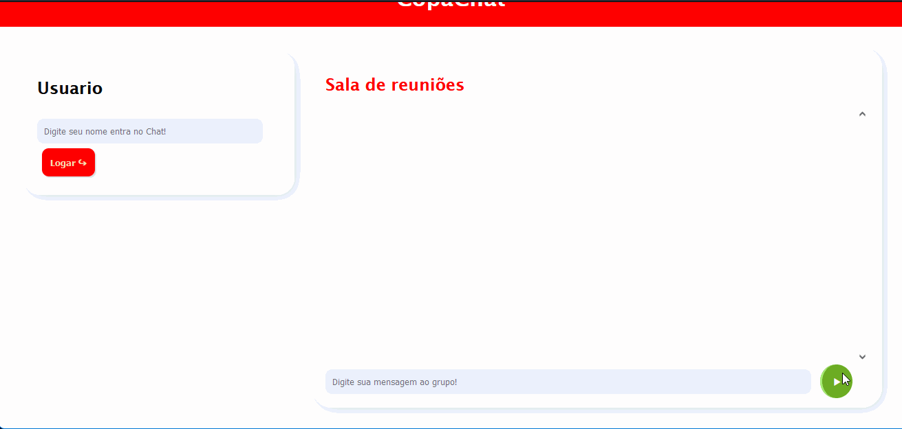
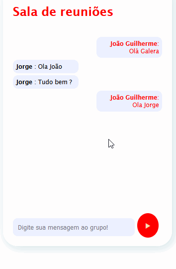

# CopaChat 💬

## Indice 👨‍💻
1. **Introdução**
1. **Desenvolvimento**
1. **Como Usar**
1. **Outras Coisas Não Tão relavantes**
1. [**Licença**](#License)

## Edições ✏️📑

Alterações   | Data
:---------: | :------:
Emissão Inicial | 09/01/2022

### Tecnologias Usados
#### 🧑‍💻 No front-end
**_HTML_**

**_CSS_**

**_Javascript_**

#### 👥 No Back-end
**_NODE js_**

**_Socket.IO_**

**_ExpressJs_**

### 1. 🚪 Introdução

Isto é um pequeno projeto de Chat para práticar, conexão, com o ***socket***. Tem o intuito de varios usuários
de localidade diferente de uma rede local, manterem uma conversa corporativa entre eles. E voltado para 
pequenas empresas manterem conversas internas em grupo.

### 2. Desenvolvimento ⚙️

Como citado acima esse projeto foi desenvolvido com instuito 
de treinamento na parte Back-end, especificamente, em conexão com o Socket puro, usei no **Nodejs, Express, Socket.IO**
para construir API, que é local. 

Usei somente **CSS**, para dar minha propria cara ao Projeto. Além do mais, vale resaltar que estou criando
meu próprio **framework CSS**  😁, vale a pena de uma conferida nele quem quiser....
### 3. 👇🤘 Para Usar
1.Tenha um **NODEjs** instalado.
1. Clone o projeto 
1. Entre no Diretorio no **CMD ou em Outro terminal** de comando.
1. Esse comando irá iniciar o servidor abaixo...

        node index.js

No mais muito obrigado a todos que visualizaram, caso alguma dúvida pode entrar em contato aqui pelo 😁 **Github** Clique aqui.

## 4. Outras Coisas Não Tão relavantes 📁😅🤪...

Na estrutura de diretorios há 2 pastas:

### assests 📁
Onde estão as imagens e icones da aplicação.
### public 📁
Onde estão a pagina do Cliente.
### index.js
Onde esta o codigo-fonte da aplicação. 😅🤗

### Autor
---
 
  
 <b>Joao Guilherme</b></a> <a href="https://github.com/JoaoG23/">🚀</a>

Feito com 🤭 por Joao Guilherme 👋🏽 Entre em contato!

 

### **License**

